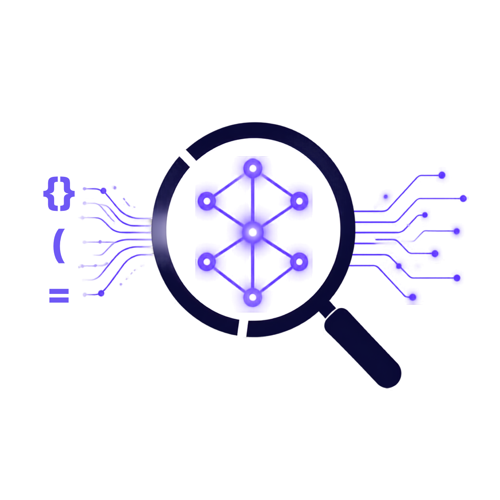

<a id="readme-top"></a>

<!-- ===================== ANIMATED HEADER ===================== -->
<div align="center">

<!-- Logo -->


<!-- Title -->
<br/>

# **CodeNexus**

<p align="center">
  <em>Ask natural language questions about any codebase. Get relevant code snippets with AI-powered explanations.</em>
</p>

<!-- Tech Stack Animated Badges -->


<br/>

<!-- Status Badges -->
<a href="https://github.com/Garvittt-API/CodeNexus/actions"></a>
<a href="https://github.com/Garvittt-API/CodeNexus/blob/main/LICENSE"></a>
<a href="https://github.com/Garvittt-API/CodeNexus/stargazers"></a>
<a href="https://github.com/Garvittt-API/CodeNexus/network/members"></a>
<a href="https://github.com/Garvittt-API/CodeNexus/graphs/contributors"></a>

<br/>
<br/>

<!-- Quick Nav -->
<a href="#quick-start"></a>&nbsp;
<a href="https://github.com/Garvittt-API/CodeNexus/blob/main/docs/api.md"></a>&nbsp;
<a href="https://github.com/Garvittt-API/CodeNexus/issues/new?labels=bug&template=bug_report.md"></a>&nbsp;
<a href="https://github.com/Garvittt-API/CodeNexus/issues/new?labels=enhancement&template=feature_request.md"></a>

<br/>

<!-- Animated wave -->


</div>

<!-- ===================== ABOUT ===================== -->
<div align="center">
<strong>CodeNexus</strong> is a full-stack <strong>Semantic Code Search</strong> engine that bridges the gap between human language and code.<br/>
Unlike keyword search, CodeNexus understands <strong>meaning</strong> — ask <em>"How does authentication work?"</em> and get the exact functions, classes, and files that implement it.
</div>

<br/>

<div align="center">

|  |  |  |
|:---:|:---:|:---:|
| **Zero API keys** | **AST-aware chunking** | **Two-stage ranking** |
| Embeddings run locally via `sentence-transformers` | Code split at function/class boundaries | FAISS ANN + cross-encoder re-ranking |
| **6 LLM providers** | **30+ languages** | **One command deploy** |
| Ollama, OpenAI, Anthropic, Gemini, DeepSeek, Mistral | Python, JS, TS, Java, Go, Rust, C/C++, and more | `docker-compose up` and you're running |

</div>

<p align="right">(<a href="#readme-top">back to top</a>)</p>

---

## Features

<table>
<tr>
<td width="50%">

### Intelligent Code Search
- Natural language queries
- 30+ programming languages
- AST-based semantic chunking
- Cross-encoder re-ranking
- Sub-second search latency

</td>
<td width="50%">

### AI-Powered Explanations
- LLM-generated insights
- Streaming SSE responses
- Code context awareness
- 6 LLM providers supported
- File paths & line numbers cited

</td>
</tr>
<tr>
<td width="50%">

### Repository Management
- Local folder import
- GitHub / Git URL support
- Drag & drop upload
- Real-time indexing progress
- Multi-repo support

</td>
<td width="50%">

### Production Ready
- Docker Compose deployment
- Rate limiting & security
- GitHub Actions CI/CD
- Comprehensive docs
- Pre-commit hooks

</td>
</tr>
</table>

<p align="right">(<a href="#readme-top">back to top</a>)</p>

---

## Architecture

```
 ┌─────────────────────────────────────────────────────────────────────────────┐
 │                                                                             │
 │    USER QUERY                                                              │
 │    "How does the payment system work?"                                     │
 │         │                                                                   │
 │         ▼                                                                   │
 │   ┌──────────────┐    ┌──────────────┐    ┌──────────────┐                  │
 │   │              │    │              │    │              │                  │
 │   │   EMBED      │───▶│  FAISS ANN   │───▶│ CROSS-ENCODER│                  │
 │   │   (bge)      │    │  Top-100     │    │  Re-rank     │                  │
 │   │              │    │              │    │  Top-20      │                  │
 │   └──────────────┘    └──────────────┘    └──────┬───────┘                  │
 │                                                   │                         │
 │                                    ┌──────────────┴──────────────┐          │
 │                                    │                             │          │
 │                                    ▼                             ▼          │
 │                           ┌──────────────┐             ┌──────────────┐     │
 │                           │              │             │              │     │
 │                           │   RESULTS    │             │  LLM EXPLAIN │     │
 │                           │   (JSON)     │             │  (Streaming) │     │
 │                           │              │             │              │     │
 │                           └──────────────┘             └──────────────┘     │
 │                                                                             │
 └─────────────────────────────────────────────────────────────────────────────┘
```

<p align="right">(<a href="#readme-top">back to top</a>)</p>

---

## Tech Stack

<div align="center">

| Layer | Stack |
|-------|-------|
| **Frontend** | Next.js 14, React 18, TailwindCSS 3.4, Zustand, react-syntax-highlighter |
| **Backend** | FastAPI, Python 3.11, Pydantic v2, SQLAlchemy 2.0 |
| **AI / ML** | sentence-transformers, FAISS, tree-sitter, cross-encoder |
| **LLM** | Ollama (default), OpenAI, Anthropic, Gemini, DeepSeek, Mistral |
| **Infra** | Docker, Redis, GitHub Actions, SQLite |

</div>

<p align="right">(<a href="#readme-top">back to top</a>)</p>

---

<!-- GETTING STARTED -->
## Quick Start

### Prerequisites

- Python 3.11+
- Node.js 20+
- Docker & Docker Compose (recommended)

### One-Command Deploy

```bash
git clone https://github.com/Garvittt-API/CodeNexus.git
cd CodeNexus
cp .env.example .env
docker-compose up -d
```

> **Frontend:** http://localhost:3000 &nbsp;&nbsp;|&nbsp;&nbsp; **API:** http://localhost:8000 &nbsp;&nbsp;|&nbsp;&nbsp; **Docs:** http://localhost:8000/docs

### Manual Setup

<details>
<summary><strong>Backend</strong></summary>

```bash
cd backend
python -m venv venv
source venv/bin/activate      # Windows: venv\Scripts\activate
pip install -r requirements.txt
uvicorn app.main:app --reload --port 8000
```

</details>

<details>
<summary><strong>Frontend</strong></summary>

```bash
cd frontend
npm install
npm run dev
```

</details>

<p align="right">(<a href="#readme-top">back to top</a>)</p>

---

<!-- USAGE EXAMPLES -->
## Usage

### Search Code

```bash
curl -X POST http://localhost:8000/api/search \
  -H "Content-Type: application/json" \
  -d '{"query": "How does authentication work?", "top_k": 10}'
```

**Response:**
```json
{
  "query": "How does authentication work?",
  "results": [
    {
      "file_path": "src/auth/login.py",
      "content": "def authenticate(username, password):...",
      "start_line": 15,
      "end_line": 42,
      "score": 0.9234,
      "rank": 1
    }
  ],
  "search_time_ms": 156.7
}
```

### Search + AI Explanation

```bash
curl -X POST http://localhost:8000/api/search/explain \
  -H "Content-Type: application/json" \
  -d '{"query": "Explain the payment processing flow"}'
```

### Import a Repository

```bash
curl -X POST http://localhost:8000/api/repos/import \
  -H "Content-Type: application/json" \
  -d '{"source": "https://github.com/user/repo", "source_type": "github"}'
```

<p align="right">(<a href="#readme-top">back to top</a>)</p>

---

## Project Structure

```
CodeNexus/
├── backend/
│   ├── app/
│   │   ├── api/routes/          # REST endpoints
│   │   ├── core/                # Config, security, exceptions
│   │   ├── domain/              # Entities & value objects
│   │   ├── services/            # Business logic
│   │   │   ├── parsing.py       # AST-based code parsing
│   │   │   ├── indexing.py      # Repository indexing
│   │   │   └── search.py        # Search & RAG pipeline
│   │   └── infrastructure/      # External integrations
│   │       ├── vector_db.py     # FAISS vector database
│   │       ├── embedding_provider.py
│   │       ├── reranker.py      # Cross-encoder re-ranking
│   │       └── llm_provider.py  # Multi-provider LLM
│   └── tests/
├── frontend/
│   ├── app/                     # Next.js App Router
│   ├── components/              # React components
│   └── lib/                     # API client & state
├── docs/                        # Documentation
├── docker-compose.yml
└── .github/workflows/ci.yml
```

<p align="right">(<a href="#readme-top">back to top</a>)</p>

---

<!-- ROADMAP -->
## Roadmap

- [x] Repository import (local, GitHub, Git)
- [x] AST-based code chunking with tree-sitter
- [x] Local embeddings with sentence-transformers
- [x] FAISS vector search
- [x] Cross-encoder re-ranking
- [x] Multi-provider LLM integration
- [x] Streaming SSE explanations
- [x] Docker Compose deployment
- [x] GitHub Actions CI/CD
- [ ] PostgreSQL + pgvector support
- [ ] WebSocket real-time updates
- [ ] Code diff search
- [ ] Collaborative repositories
- [ ] VS Code extension

<p align="right">(<a href="#readme-top">back to top</a>)</p>

---

<!-- CONTRIBUTING -->
## Contributing

Contributions make the open source community an amazing place to learn, inspire, and create. Any contributions are **greatly appreciated**.

1. Fork the Project
2. Create your Feature Branch (`git checkout -b feature/AmazingFeature`)
3. Commit your Changes (`git commit -m 'Add some AmazingFeature'`)
4. Push to the Branch (`git push origin feature/AmazingFeature`)
5. Open a Pull Request

<p align="right">(<a href="#readme-top">back to top</a>)</p>

---

<!-- LICENSE -->
## License

Distributed under the MIT License. See `LICENSE` for more information.

<p align="right">(<a href="#readme-top">back to top</a>)</p>

---

<!-- CONTACT -->
## Contact

<div align="center">

**Built by Garvitt**

[](https://github.com/Garvittt-API)
[](https://linkedin.com/)

**Project Link:** [https://github.com/Garvittt-API/CodeNexus](https://github.com/Garvittt-API/CodeNexus)

</div>

<p align="right">(<a href="#readme-top">back to top</a>)</p>

---

<!-- ACKNOWLEDGMENTS -->
## Acknowledgments

<div align="center">

| | | |
|:---:|:---:|:---:|
| [](https://www.sbert.net/) | [](https://faiss.ai/) | [](https://tree-sitter.github.io/) |
| [](https://fastapi.tiangolo.com/) | [](https://nextjs.org/) | [](https://ollama.com/) |

</div>

<p align="right">(<a href="#readme-top">back to top</a>)</p>

---

<div align="center">

### **If you find CodeNexus useful, please give it a star!**

<br/>

<a href="https://github.com/Garvittt-API/CodeNexus">
  
</a>

<br/>
<br/>


*Made with care by [Garvitt](https://github.com/Garvittt-API) — Powered by AI, built for developers.*

</div>
